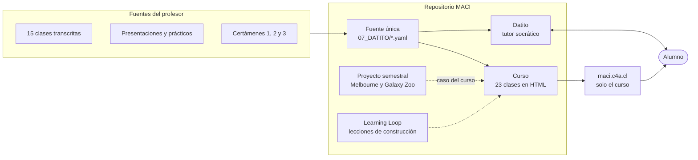
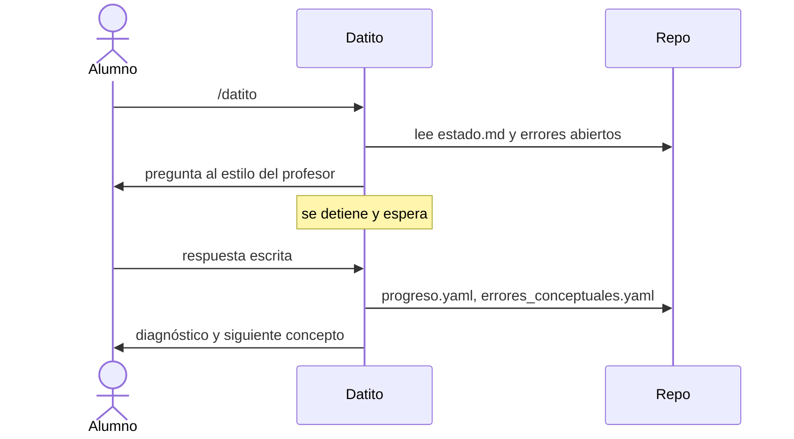
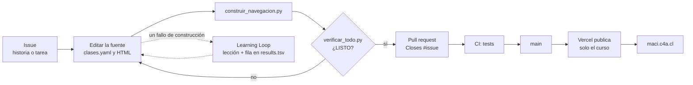

# MACI — Máquina Asistida de Ciencia de Datos Interactiva

Repositorio de trabajo de **Fundamentos de Ciencia de Datos** (FCD), Universidad de Concepción, T2-2026.

**Curso en línea:** https://maci.c4a.cl · **Tablero:** [Project MACI](https://github.com/users/cherrera0001/projects/3) · **Versión en curso:** [v1.0](https://github.com/cherrera0001/MACI/milestone/3) · **Wiki:** [cómo opera](https://github.com/cherrera0001/MACI/wiki)

## ¿Qué es MACI?

MACI reúne tres productos y la plataforma que los sostiene:

1. **El curso**: 23 clases en 6 unidades, en HTML interactivo que funciona sin conexión. 22 están construidas; la clase 19 (repaso integrado Melbourne) está pendiente. Incluye 3 certámenes con su resolución.
2. **Datito**: tutor personal socrático (skill `.claude/skills/datito/`). Registra el progreso, los errores y las dudas resueltas.
3. **El proyecto semestral**: predicción de precios en Melbourne y desafío Galaxy Zoo (`08_PROYECTO_FCD/`, `09_RESULTADOS/`).



## ¿Qué es Datito?

Datito es el tutor. Corre en Claude Code con `/datito`; el sitio en línea tiene solo el material. Datito pregunta, **espera tu respuesta**, diagnostica y registra evidencia; nunca simula tu respuesta. Un concepto llega a `DOMINADO` solo cuando lo explicaste, lo aplicaste, lo interpretaste y lo transferiste a un caso nuevo.



Las reglas están en `.claude/skills/datito/SKILL.md` y el contrato en `00_INICIO/spec.md`. Otros comandos: `/datito-corregir`, `/datito-progreso`, `/datito-pedagogia`, `/datito-visual` y `/datito-loop`.

## Cómo llega un cambio al sitio



Los seis procesos del proyecto, con sus subprocesos, están en [`docs/wiki/Procesos.md`](docs/wiki/Procesos.md).

## Pendientes

El estado al día está en el [milestone v1.0](https://github.com/cherrera0001/MACI/milestone/3). Al 2026-10-01:

| Prioridad | Pendiente | Issue |
|---|---|---|
| **P0** | Decidir qué queda versionado en el repo público: datos personales, transcripciones y material del ramo | [#65](https://github.com/cherrera0001/MACI/issues/65) |
| P1 | Construir la clase 19, el repaso integrado sobre Melbourne | [#31](https://github.com/cherrera0001/MACI/issues/31) |
| P1 | Alinear `historias_usuario.yaml` con las 23 clases vigentes | [#42](https://github.com/cherrera0001/MACI/issues/42) |
| P1 | Vistas del tablero y publicación de la wiki | [#69](https://github.com/cherrera0001/MACI/issues/69), [#73](https://github.com/cherrera0001/MACI/issues/73) |
| P2 | Auditoría de rutas, espejo `.agents/skills` y ramas huérfanas | [#49](https://github.com/cherrera0001/MACI/issues/49), [#61](https://github.com/cherrera0001/MACI/issues/61), [#75](https://github.com/cherrera0001/MACI/issues/75) |
| Después de v1.0 | Estudiar los 21 conceptos con Datito, NotebookLM, glosario y mejoras del Learning Loop | [#38](https://github.com/cherrera0001/MACI/issues/38), [#35](https://github.com/cherrera0001/MACI/issues/35), [#54](https://github.com/cherrera0001/MACI/issues/54) |

## Estudiar

- **En línea:** https://maci.c4a.cl abre el índice del curso.
- **Sin conexión:** abre `07_DATITO/01_CONCEPTOS/visual/00_index.html` con doble clic.

Cada clase abre con su objetivo, su ficha Bloom (evidencia, actividad final, criterio de dominio) y una pregunta de activación. Cierra con qué aprendiste, qué no confundir, un procedimiento para el papel y una pregunta final con su respuesta oculta. Predice antes de mover un control y responde antes de abrir cada `<details>`.

## Fuentes únicas

Todo lo que ves en las páginas se genera desde estos archivos. No hay otra copia.

| Archivo | Qué contiene |
|---|---|
| `07_DATITO/clases.yaml` | 23 clases: orden, unidad, ficha Bloom, activación y cierre |
| `07_DATITO/curriculum.yaml` | 21 conceptos, prerrequisitos y material citado |
| `07_DATITO/grafo.yaml` | Dependencias y prioridades (lo genera `03_SCRIPTS/grafo_conceptual.py`) |
| `07_DATITO/dudas.yaml` | 6 dudas resueltas por Datito, renderizadas en sus clases |
| `07_DATITO/progreso.yaml` | Estado de cada concepto (NO_ESTUDIADO → … → DOMINADO) con evidencia |
| `07_DATITO/errores_conceptuales.yaml` | Errores observados y patrones vigilados |
| `07_DATITO/historias_usuario.yaml` | 18 historias de usuario; describen una numeración anterior ([#42](https://github.com/cherrera0001/MACI/issues/42)) |
| `05_CLASES/mapa_ensenanza.yaml` | Dónde se enseñó cada concepto en las 15 clases transcritas |

## Estructura

```
07_DATITO/
  01_CONCEPTOS/visual/   00_index.html (portada) y 16 clases numeradas; _TEMPLATE_CANONICO.html
  02_REFERENCIA/         clase6_regresion.html (clase 5) y material de referencia
  04_EJERCICIOS/         certamen_1..3, triaje, simulador de predicción de falla, guías, cuadernillos
  06_AUDITORIAS/         patron_evaluacion.md: cómo evalúa el profesor
  07_BITACORA/           una entrada por sesión de Datito
05_CLASES/transcripciones/   15 clases transcritas (se citan con marca de tiempo)
docs/                        despliegue, ADR, gestión (backlog e histórico) y fuente de la wiki
```

## Mantener

```bash
python 03_SCRIPTS/verificar_todo.py --navegador  # todo en uno: debe decir LISTO antes de publicar
python 03_SCRIPTS/construir_navegacion.py      # regenera portada, barras, cierres y dudas (idempotente)
python 03_SCRIPTS/datito_estado.py             # resumen de estado tras cada sesión
python 03_SCRIPTS/verificar_contrato.py        # garantías de Datito (spec.md G1–G14)
python -m unittest discover -s 04_CODIGO -p "test_*.py"
uv run --with playwright python 03_SCRIPTS/probar_visuales_offline.py   # Edge real, sin red, 390 y 1280 px
```

Los tests corren en CI (GitHub Actions) en cada push. `04_CODIGO/test_curso_integro.py` exige, en todas las páginas del curso:

- 0 enlaces o anclas rotos y 0 relleno.
- Viewport, y el cierre de cada clase.
- Cada duda renderizada.
- Una sola copia de cada dato.
- Generador sin cambios pendientes.
- Sitio publicado sin enlaces rotos.

Para crear o cambiar una clase: edita `07_DATITO/clases.yaml` y el HTML con `/datito-visual` (siempre desde `_TEMPLATE_CANONICO.html`). Luego corre `construir_navegacion.py` y los tests.

## Publicación

`vercel.json` corre `node 03_SCRIPTS/publicar_sitio.mjs`, que arma `public/` solo con el curso: clases, clase 5, certámenes, guías y cuadernillos. Las transcripciones, los YAML y los datos personales no se publican; en línea, sus citas aparecen como texto. Cada push a `main` se despliega en https://maci.c4a.cl. Detalle: `docs/DEPLOYMENT.md`.

## Gestión

El trabajo se sigue en el [Project MACI](https://github.com/users/cherrera0001/projects/3): épica `[E-n]` → historia `[H-n.m]` o decisión `[D-n.m]` → tarea `[T-n.m.p]`, enlazadas como sub-issues, con Tipo, Prioridad y Proceso.

| Épica | Resultado |
|---|---|
| [E-1 Curso](https://github.com/cherrera0001/MACI/issues/30) | Las 23 clases se estudian completas, sin conexión y fieles a la fuente |
| [E-2 Datito](https://github.com/cherrera0001/MACI/issues/38) | El tutor lleva al alumno a dominar cada concepto con evidencia |
| [E-3 Plataforma](https://github.com/cherrera0001/MACI/issues/48) | Una fuente, un generador, una verificación, una publicación |
| [E-4 Learning Loop](https://github.com/cherrera0001/MACI/issues/54) | Cada fallo de construcción deja una lección que el siguiente agente lee |
| [E-5 Proyecto semestral](https://github.com/cherrera0001/MACI/issues/62) | Las entregas del ramo se reproducen desde el repo |
| [E-6 Gobernanza](https://github.com/cherrera0001/MACI/issues/64) | El repo público muestra solo lo que debe y el trabajo se sigue en GitHub |

Cómo leer el tablero y el vocabulario de GitHub Projects: [`docs/wiki/`](docs/wiki/Home.md), publicado en la [wiki](https://github.com/cherrera0001/MACI/wiki). Índice de la carpeta de gestión: [`docs/gestion/README.md`](docs/gestion/README.md).

---

Contenido académico: profesor titular, UdeC · Repositorio: https://github.com/cherrera0001/MACI · Seguimiento: [Project MACI](https://github.com/users/cherrera0001/projects/3)
