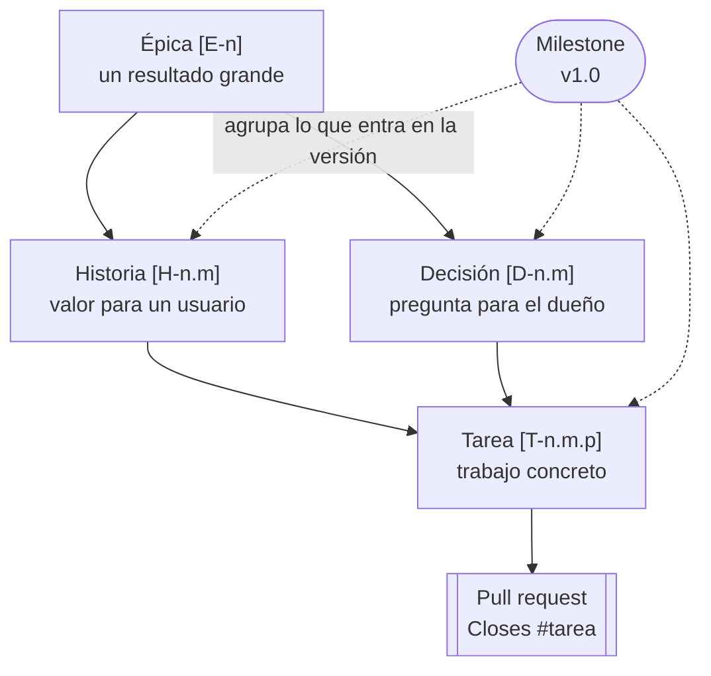
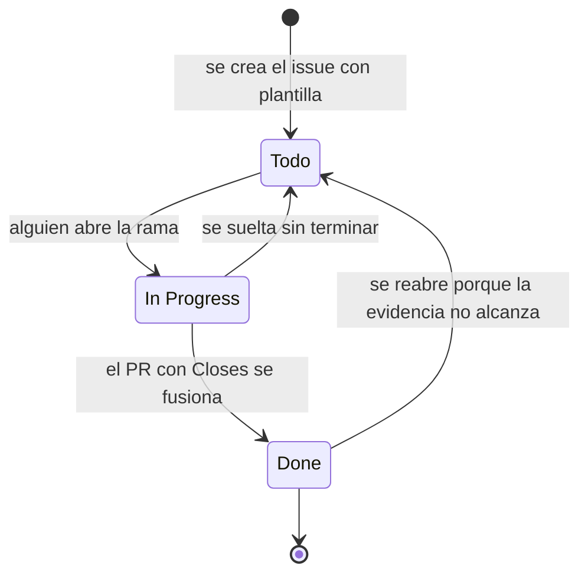

# Cómo opera el tablero

El trabajo de MACI se sigue en el [Project MACI](https://github.com/users/cherrera0001/projects/3). El estado de cada ítem vive en su issue; ningún archivo del repo lo duplica.

## Jerarquía



| Tipo | Título | Qué contiene | Se cierra cuando |
|---|---|---|---|
| **Épica** | `[E-1] Curso: …` | Resultado, contexto e historia, cómo se mide | Todas sus historias están cerradas y las métricas se cumplen |
| **Historia** | `[H-1.1] Como <rol>, quiero <capacidad>, para <beneficio>` | Contexto con evidencia, criterios de aceptación «dado, cuando, entonces», definición de hecho | Cada criterio está marcado con su evidencia |
| **Decisión** | `[D-6.1] ¿…?` | Pregunta, contexto, opciones | El dueño escribe la decisión en un comentario |
| **Tarea** | `[T-1.1.1] Verbo + objeto` | Qué hay que hacer y qué se entrega | Un PR fusionado la cierra |
| **Bug** | Texto libre | Qué se esperaba, qué pasó, cómo reproducirlo | El test que lo reproduce pasa |

El enlace entre niveles es un **sub-issue**: la historia es sub-issue de su épica y la tarea es sub-issue de su historia. El avance se lee en la columna *Sub-issues progress*.

## Campos del Project

| Campo | Valores | Para qué |
|---|---|---|
| **Status** | Todo · In Progress · Done | Dónde está el ítem |
| **Tipo** | Épica · Historia · Decisión · Tarea · Bug | Nivel en la jerarquía |
| **Prioridad** | P0 bloquea la versión · P1 entra en la versión · P2 después | Orden de trabajo |
| **Proceso** | P1 a P6, ver [Procesos](Procesos) | En qué flujo de trabajo cae |
| **Parent issue** | Automático | A qué épica o historia pertenece |
| **Milestone** | v1.0 | Si entra en la versión |

Las etiquetas repiten tipo, área y prioridad (`tipo:historia`, `area:curso`, `prioridad:P1`) para filtrar también desde la lista de issues del repo.

## Ciclo de un ítem



1. **Crear.** *New issue* en el repo y elegir plantilla. El título lleva el prefijo del tipo. Las plantillas están en `.github/ISSUE_TEMPLATE/`.
2. **Ubicar.** En el issue, *Parent issue* para colgarlo de su historia o épica. En el Project, llenar Tipo, Prioridad y Proceso. El flujo *Auto-add to project* ya lo trae al tablero.
3. **Trabajar.** Una rama por historia o tarea. Pasar el ítem a *In Progress*.
4. **Verificar.** `python 03_SCRIPTS/verificar_todo.py --navegador` tiene que decir LISTO.
5. **Cerrar.** El PR escribe `Closes #<número>` en su descripción. Al fusionarlo, GitHub cierra el issue y el tablero lo mueve a *Done*.
6. **Dejar evidencia.** Un comentario en el issue con lo que se midió. Un cierre sin evidencia se reabre.

## Vistas recomendadas

GitHub no permite crear vistas por API. Se crean una vez desde el tablero con *New view*:

| Vista | Diseño | Configuración |
|---|---|---|
| **Por épica** | Table | Group by: *Parent issue*. Columnas: Title, Tipo, Status, Prioridad, Sub-issues progress. Filtro: `is:open` |
| **Tablero** | Board | Column by: *Status*. Filtro: `-tipo:Épica`. Swimlanes por *Prioridad* |
| **v1.0** | Table | Filtro: `milestone:"v1.0 · Curso completo y verificable"`. Sort: Prioridad |
| **Por proceso** | Table | Group by: *Proceso*. Filtro: `is:open tipo:Historia,Decisión` |
| **Decisiones** | Table | Filtro: `tipo:Decisión is:open`. Son las que esperan al dueño |

## Sembrar ítems nuevos

Para uno o dos ítems, la plantilla de issue basta. Para un lote, se agregan a `docs/gestion/backlog.yaml` y se corre:

```bash
python 03_SCRIPTS/crear_backlog.py --dry-run   # muestra qué crearía
python 03_SCRIPTS/crear_backlog.py             # crea solo lo que falta
```

El script no duplica: reconoce los ítems por el prefijo de su título. El YAML es la semilla; después de sembrar, manda el issue.

## Quién decide qué

- Un agente puede crear tareas, abrir PR y dejar evidencia.
- Un agente **no** cierra una decisión, no cambia la visibilidad del repo, no borra ramas remotas ni reescribe historial sin la confirmación escrita del dueño en el issue.
- Las historias de estudio (épica de Datito) las avanza el alumno: nadie puede aprender por él.
