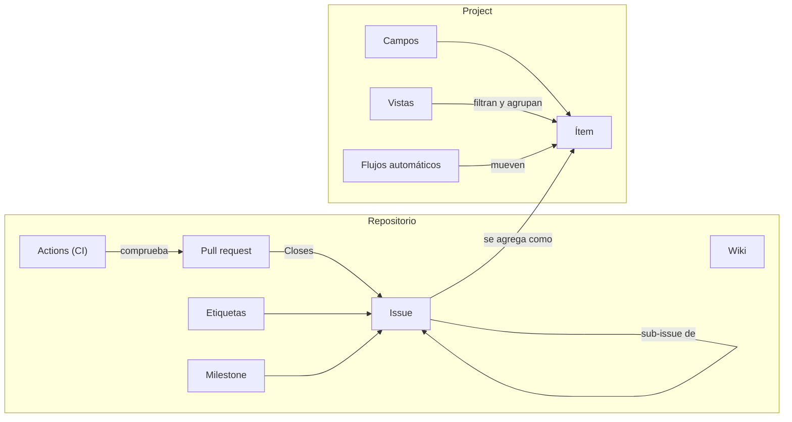

# Conceptos de GitHub Projects

Vocabulario mínimo para leer el tablero de MACI. Cada concepto trae cómo se usa aquí.

## El mapa

## En el repositorio

| Concepto | Qué es | Cómo se usa en MACI |
|---|---|---|
| **Issue** | Una unidad de trabajo con título, descripción, comentarios y estado abierto o cerrado. Tiene un número (`#31`). | Todo el backlog: épicas, historias, decisiones, tareas y bugs. |
| **Sub-issue** | Un issue hijo de otro. El padre muestra cuántos hijos están cerrados. | La jerarquía épica → historia → tarea. |
| **Etiqueta** (label) | Marca de color para clasificar. Un issue puede tener varias. | `tipo:*`, `area:*`, `prioridad:*`. |
| **Milestone** | Un conjunto de issues que forman una entrega. Muestra el porcentaje cerrado y puede tener fecha. | `v1.0`. Los dos anteriores, «Sprint 01 Lectura» y «Restauración», están cerrados. |
| **Plantilla de issue** | Formulario que pide los campos de cada tipo. | `.github/ISSUE_TEMPLATE/`: épica, historia, tarea y bug. |
| **Rama** (branch) | Línea de trabajo separada de `main`. | Una por historia o tarea. `main` siempre publicable. |
| **Pull request** (PR) | Propuesta de fusionar una rama. Se revisa y corre el CI. | Si su descripción dice `Closes #31`, al fusionarse cierra ese issue. |
| **Actions** | Automatización que corre en cada push o PR. | `.github/workflows/ci.yml` corre los tests de `04_CODIGO/`. |
| **Wiki** | Documentación del repo en páginas Markdown. Es un repositorio git aparte. | Estas páginas. La fuente está en `docs/wiki/`. |
| **Release / tag** | Una versión con nombre sobre un commit. | Cuando cierre el milestone v1.0 se etiqueta `v1.0`. |

## En el Project

Un **Project** es un tablero que reúne issues y PR de uno o varios repositorios. No guarda el trabajo: lo muestra. Si borras el Project, los issues siguen existiendo.

| Concepto | Qué es | Cómo se usa en MACI |
|---|---|---|
| **Ítem** | Un issue, un PR o un borrador dentro del Project. | Solo issues del repo MACI. |
| **Campo** (field) | Una columna con un dato del ítem. Hay campos propios del issue (Milestone, Labels, Parent issue) y campos del Project. | Del Project: Status, Tipo, Prioridad, Proceso. |
| **Status** | Campo de selección que define las columnas del tablero. | Todo · In Progress · Done. |
| **Vista** (view) | Una forma guardada de mirar los mismos ítems: tabla, tablero o línea de tiempo, con filtro, agrupación y orden. | Ver la lista en [Cómo opera el tablero](Como-opera-el-tablero). |
| **Table** | Vista de planilla. Sirve para agrupar y revisar campos. | Por épica, v1.0, Por proceso. |
| **Board** | Vista kanban: una columna por valor de un campo. | Tablero por Status. |
| **Roadmap** | Vista de línea de tiempo. Necesita un campo de fecha o de iteración. | Sin uso todavía: los ítems no tienen fechas. |
| **Filtro** | Expresión como `is:open tipo:Historia prioridad:P0`. | En cada vista. |
| **Group by** | Separa la vista en bloques por el valor de un campo. | Por *Parent issue* se ve cada épica con sus historias. |
| **Flujo automático** (workflow) | Regla integrada del Project. | Activos: *Auto-add to project* (todo issue nuevo entra), *Auto-add sub-issues*, *Item closed* (pasa a Done), *Pull request merged*. |
| **Iteración** | Campo de periodos fijos (sprints). | Sin uso: se trabaja por milestone. |
| **Insights** | Gráficos del Project, por ejemplo ítems abiertos en el tiempo. | Disponible; no se depende de él. |

## Cómo se relacionan Status, cierre y milestone

Tres cosas distintas que se suelen confundir:

- **Cerrar un issue** dice «esto terminó». Lo hace un PR con `Closes #n` o una persona.
- **Status = Done** es la columna del tablero. El flujo *Item closed* la pone sola al cerrar el issue.
- **El milestone** cuenta issues cerrados sobre el total. No mira el Status.

Por eso basta con cerrar bien los issues: el tablero y el milestone se actualizan solos.

## Buenas prácticas que seguimos

1. Un issue, un resultado comprobable. Si no se puede escribir cómo se comprueba, todavía no es un issue.
2. La evidencia va en el issue, en un comentario, antes de cerrarlo.
3. Las decisiones son issues. Una pregunta sin dueño no se pierde en un chat.
4. El Project no reemplaza al repo: las cifras se miden en el código y se citan en el issue.
