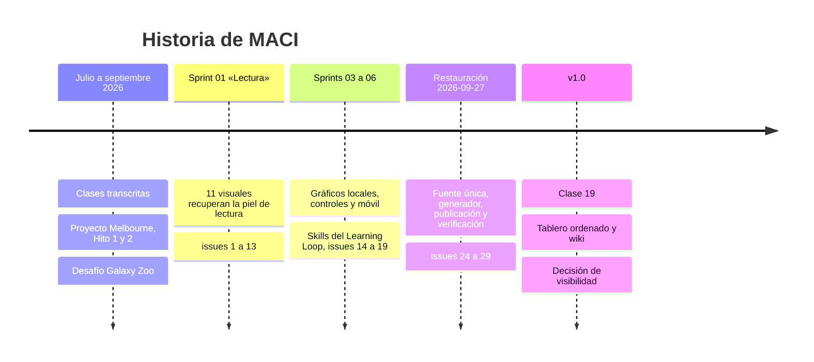

# Pendientes y v1.0

Esta página explica qué falta y por qué. El estado al día está en GitHub:

- [Milestone v1.0](https://github.com/cherrera0001/MACI/milestone/3): avance de la versión.
- [Issues abiertos](https://github.com/cherrera0001/MACI/issues): todo lo pendiente.
- [Decisiones abiertas](https://github.com/cherrera0001/MACI/issues?q=is%3Aopen+label%3Atipo%3Adecision): lo que espera al dueño.

## De dónde venimos

## Qué es v1.0

La primera versión de MACI. Se cierra cuando:

1. Las 23 clases están construidas (hoy falta la 19).
2. `python 03_SCRIPTS/verificar_todo.py --navegador --en-linea` dice LISTO con las 23.
3. No queda ningún ítem P0 o P1 abierto en el milestone.

Al cerrar se etiqueta el commit como `v1.0`.

## Épicas

| Épica | Resultado | En v1.0 |
|---|---|---|
| [E-1 Curso](https://github.com/cherrera0001/MACI/issues/30) | Las 23 clases se estudian completas, sin conexión y fieles a la fuente | Clase 19 |
| [E-2 Datito](https://github.com/cherrera0001/MACI/issues/38) | El tutor lleva al alumno a dominar cada concepto con evidencia | Historias de usuario alineadas |
| [E-3 Plataforma](https://github.com/cherrera0001/MACI/issues/48) | Una fuente, un generador, una verificación, una publicación | Auditoría de rutas |
| [E-4 Learning Loop](https://github.com/cherrera0001/MACI/issues/54) | Cada fallo deja una lección que el siguiente agente lee | Memoria legible, espejo de skills |
| [E-5 Proyecto semestral](https://github.com/cherrera0001/MACI/issues/62) | Las entregas se reproducen desde el repo | Fuera de v1.0 |
| [E-6 Gobernanza](https://github.com/cherrera0001/MACI/issues/64) | El repo público muestra solo lo que debe | Decisión de visibilidad, tablero, wiki, ramas |

## Pendientes de v1.0, por prioridad

| Prioridad | Ítem | Qué falta |
|---|---|---|
| **P0** | [D-6.1](https://github.com/cherrera0001/MACI/issues/65) | Decidir qué queda versionado en el repo público: datos personales, transcripciones y material del ramo |
| P1 | [H-1.1](https://github.com/cherrera0001/MACI/issues/31) | Construir la clase 19, el repaso integrado sobre Melbourne |
| P1 | [H-2.2](https://github.com/cherrera0001/MACI/issues/42) | `historias_usuario.yaml` describe 18 clases que ya no existen y cita 5 conceptos fuera del currículo |
| P1 | [H-4.1](https://github.com/cherrera0001/MACI/issues/55) | Memoria del Learning Loop legible. Hecho en la rama; se cierra al fusionar el PR |
| P1 | [H-6.2](https://github.com/cherrera0001/MACI/issues/69) | Crear las vistas del tablero y decidir si el Project pasa a público |
| P1 | [H-6.3](https://github.com/cherrera0001/MACI/issues/73) | Publicar esta wiki |
| P2 | [H-3.1](https://github.com/cherrera0001/MACI/issues/49) | `auditar_drift_documental.py` falla con 5 rutas que ya no existen |
| P2 | [D-4.4](https://github.com/cherrera0001/MACI/issues/61) | Versionar o ignorar `.agents/skills` |
| P2 | [H-6.4](https://github.com/cherrera0001/MACI/issues/75) | Revisar y borrar 5 ramas huérfanas |

## Después de v1.0

| Ítem | Qué es |
|---|---|
| [H-2.1](https://github.com/cherrera0001/MACI/issues/39) | Recorrer los 21 conceptos con Datito. Lo avanza el alumno |
| [H-2.3](https://github.com/cherrera0001/MACI/issues/45) | Subir a NotebookLM las 10 transcripciones que faltan |
| [H-1.2](https://github.com/cherrera0001/MACI/issues/35) | Glosario del curso |
| [H-3.2](https://github.com/cherrera0001/MACI/issues/52) | Comprobar las cifras del README contra la fuente |
| [H-4.2](https://github.com/cherrera0001/MACI/issues/56) | Que una corrida del loop no se registre con una lección ajena |
| [H-4.3](https://github.com/cherrera0001/MACI/issues/59) | Que el gate del loop compruebe que el control funciona |
| [D-5.1](https://github.com/cherrera0001/MACI/issues/63) | Qué entregas del proyecto semestral quedan |

Esta página es una foto del 2026-10-01. Si contradice a un issue, manda el issue.
