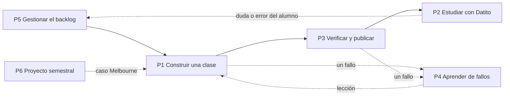
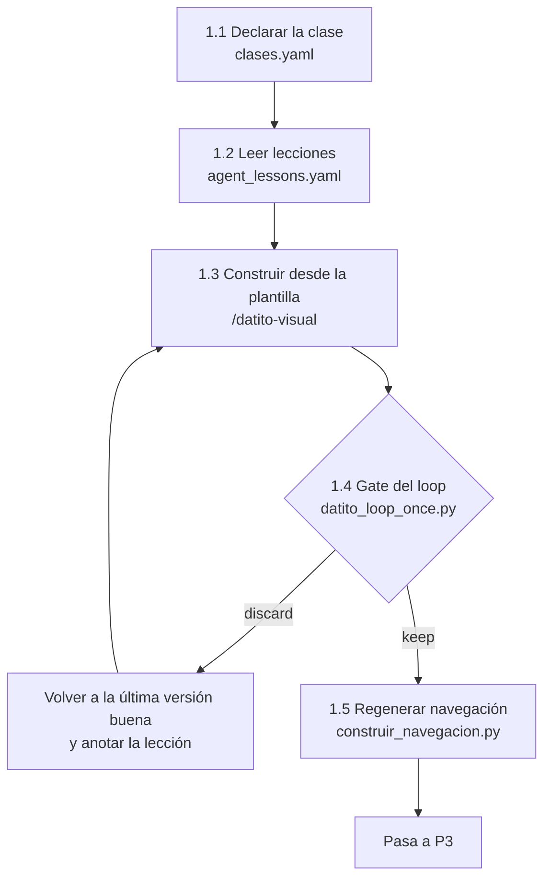
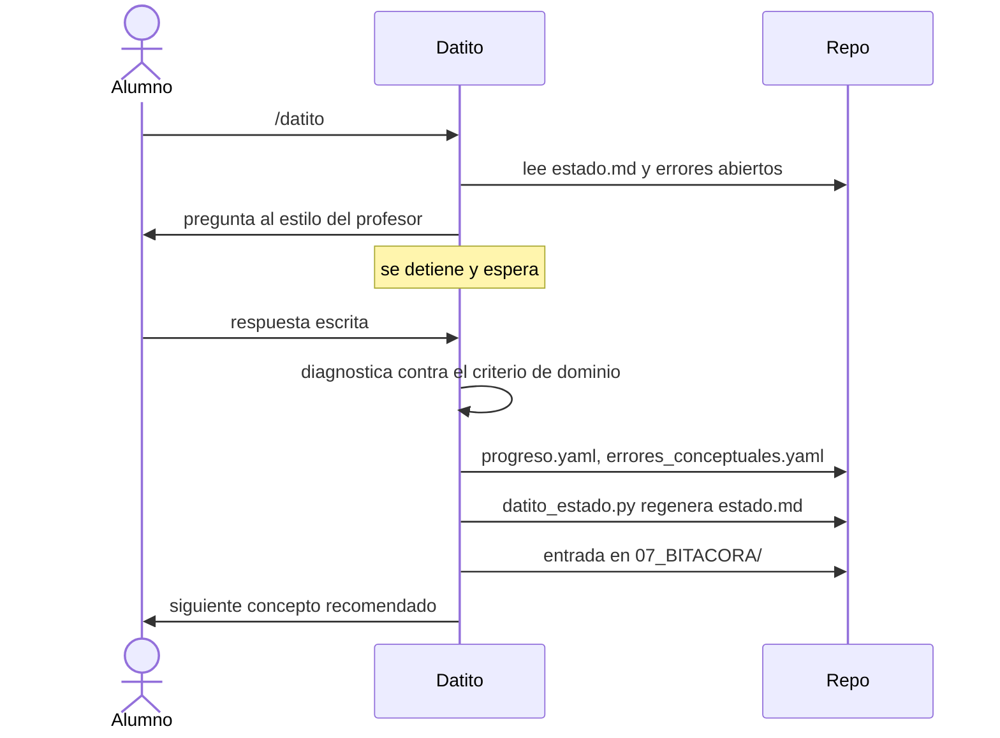
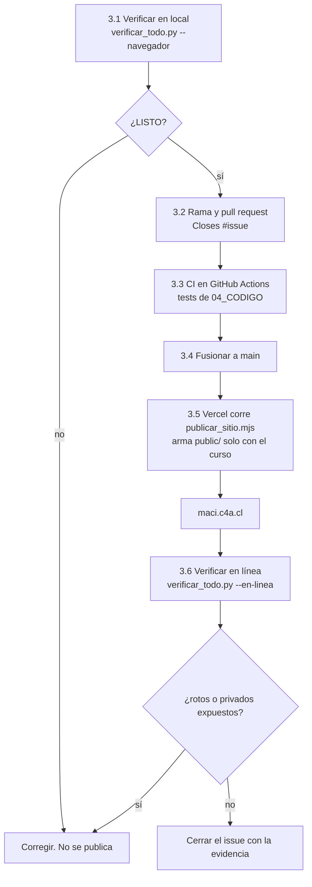
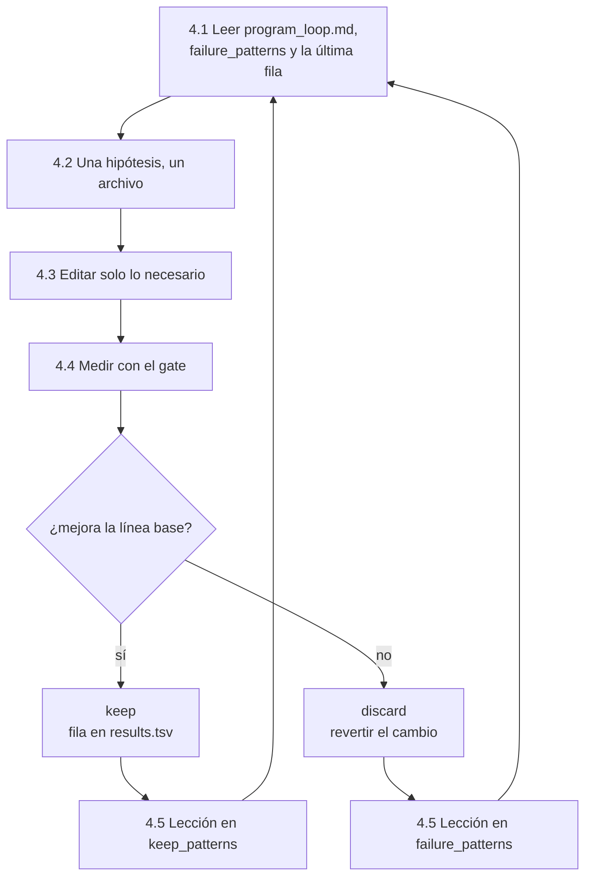
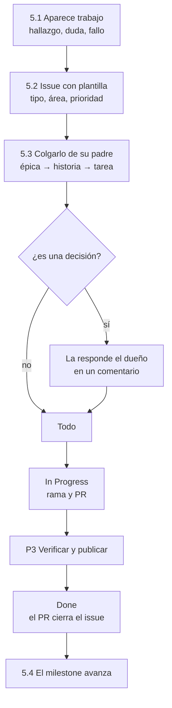
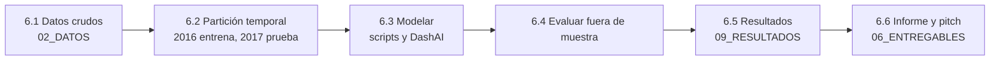

# Procesos

Todo issue del tablero pertenece a uno de estos seis procesos (campo **Proceso**). Cada proceso tiene subprocesos con un comando y un criterio de salida.

## P1 Construir una clase

| Subproceso | Entrada | Salida | Criterio |
|---|---|---|---|
| 1.1 Declarar | Material del profesor | Entrada en `07_DATITO/clases.yaml` con objetivo, Bloom, activación y cierre | La clase cita su concepto de `curriculum.yaml` |
| 1.2 Leer lecciones | `agent_lessons.yaml` | Lista de fallos que aplican | `failure_patterns` leído completo |
| 1.3 Construir | `_TEMPLATE_CANONICO.html` | Un HTML | Sin CDN, con el marcador de plantilla, cifras fieles a la fuente |
| 1.4 Gate | El HTML | Fila en `results.tsv` | `keep_eligible=true` y lectura comprobada en navegador |
| 1.5 Navegación | `clases.yaml` | Portada, barras, cierres y dudas | El generador no deja cambios pendientes |

## P2 Estudiar con Datito

| Subproceso | Comando | Salida |
|---|---|---|
| 2.1 Sesión socrática | `/datito` | Evidencia en `progreso.yaml` y entrada de bitácora |
| 2.2 Corrección por lote | `/datito-corregir` | Informe y entrenamiento dirigido a los fallos |
| 2.3 Informe de avance | `/datito-progreso` | Qué se domina, qué se confunde y qué sigue |
| 2.4 Auditoría pedagógica | `/datito-pedagogia` | Brechas entre el material y el nivel que exige la evaluación |

## P3 Verificar y publicar

`verificar_todo.py` reúne seis comprobaciones: generador sin pendientes, contrato de Datito, citas y enlaces, tests, navegador real a 390 y 1280 px, y el sitio en vivo. Cada una existe porque ese error ya ocurrió.

## P4 Aprender de fallos (Agents Learning Loop)

No se entrena ningún modelo. Lo que mejora es el repositorio: un agente cambia un archivo, lo mide con un gate fijo y deja escrito si el cambio se conserva.

Reglas:

- Una lección `-FAIL-` va en `failure_patterns` y una `-KEEP-` en `keep_patterns`. Lo comprueba `04_CODIGO/test_learning_loop.py`.
- Toda lección lleva su fila en `results.tsv`.
- El score no cierra una tarea por sí solo: certifica la piel de la página, no que el control funcione.

## P5 Gestionar el backlog

Detalle en [Cómo opera el tablero](Como-opera-el-tablero).

## P6 Proyecto semestral

Regla del método: ninguna información de 2017 entra al entrenamiento, y cada cifra de un informe se regenera con un script del repo.
