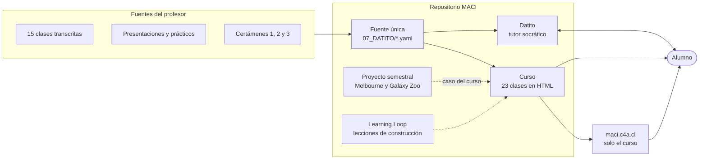
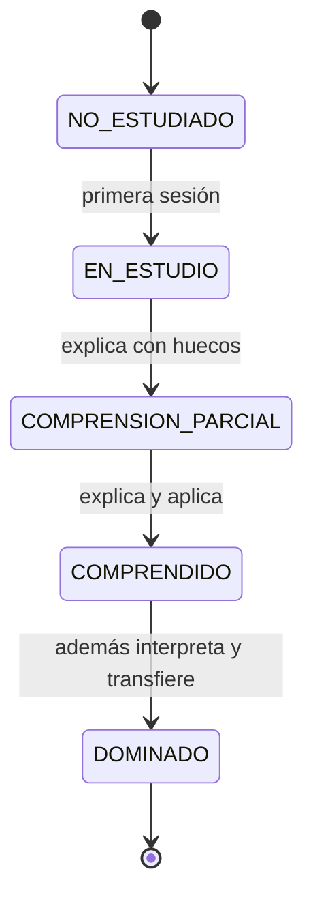

# Qué es MACI y Datito

## MACI

MACI es el repositorio. Tiene tres productos y la plataforma que los sostiene.

| Pieza | Qué es | Dónde vive |
|---|---|---|
| **Curso** | 23 clases en 6 unidades. Cada una abre con objetivo, ficha Bloom y una pregunta de activación, y cierra con qué aprendiste, qué no confundir, un procedimiento y una pregunta final. Funciona sin conexión. | `07_DATITO/01_CONCEPTOS/visual/`, `02_REFERENCIA/`, `04_EJERCICIOS/` |
| **Datito** | Tutor personal. Corre en Claude Code, no en el sitio. | `.claude/skills/datito*/`, contrato en `00_INICIO/spec.md` |
| **Proyecto semestral** | Predicción de precios en Melbourne (entrenar con 2016, predecir 2017) y desafío Galaxy Zoo. | `08_PROYECTO_FCD/`, `09_RESULTADOS/` |
| **Plataforma** | Generador de navegación, verificación y publicación. | `03_SCRIPTS/`, `04_CODIGO/`, `.github/workflows/` |
| **Learning Loop** | Memoria de fallos de los agentes que construyen las páginas. | `07_DATITO/07_BITACORA/learning_loop/` |

## Datito

Datito no explica y se va. Pregunta, **espera la respuesta**, diagnostica el error y registra evidencia. Un concepto llega a `DOMINADO` solo cuando el alumno lo explicó, lo aplicó, lo interpretó y lo transfirió a un caso nuevo.

| Comando | Para qué |
|---|---|
| `/datito` | Sesión socrática sobre un concepto |
| `/datito-corregir` | Corrige un lote de respuestas escritas y actualiza el progreso |
| `/datito-progreso` | Informe de qué se domina y qué sigue. Solo lectura |
| `/datito-pedagogia` | Audita si el material apunta al nivel que la evaluación exige |
| `/datito-visual` | Construye una página del curso desde la plantilla canónica |
| `/datito-loop` | Una corrida del Learning Loop tras un fallo de construcción |

Archivos que Datito lee y escribe:

- `07_DATITO/curriculum.yaml`: 21 conceptos con prerrequisitos y fuentes.
- `07_DATITO/progreso.yaml`: estado y evidencia de cada concepto.
- `07_DATITO/errores_conceptuales.yaml`: errores observados, con la frase del alumno.
- `07_DATITO/estado.md`: resumen generado por `datito_estado.py`. No se edita a mano.

## Qué no es

- No es un curso oficial de la universidad. El contenido académico es del profesor titular; aquí se estudia y se cita.
- El sitio no tiene tutor. Datito corre en local.
- El score del Learning Loop no mide aprendizaje. Mide que la página respeta la plantilla y no depende de la red.
